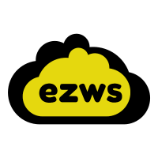

# ezws
> 

## about
`ezwsh.sh` is a thin wrapper for AWS CLI, specifically for the EC2 functionally. If you have to start or stop a machine, the IP address will change. This wrapper looks up what the current IP address is when you try to connect to a given node, among other useful features. 

## usage

### quick guide
`ezws.sh` supports the following commands:
1. `add`: adding (configuring) a node to save for future usage
1. `list`: list the nodes that have been configured
1. `connect`: connecting to a node (ssh protocol)
1. `startup`: starting a node 
1. `stop`: stop a node (turn off)
1. `sftp`: upload/download files (sftp protocol)
1. `sshfs`: remote file management (sshfs protocol)
1. `bind`: bind a ports between remote and local machines (ssh protocol)
1. `reindex`: re-adds all the added machines to tab completion (this needs to be run after each update)

note: your AWS IAM profile will need the expected permissions to run these commands. To look up an instance's IP address, the permission for `ec2:DescribeInstances` is also required. Contact your AWS administrator to get this permission if you do not already have it. 

### full guide
1. `add` adding a new AWS node
You will need to do this before you starting interacting with a node. `ezws.sh` saves this information locally to use with other commands. 
This is a one time step needed for each machine. This command will ask four questions: 
- what do you want the friendly name to be (this can be anything)
- what is the instance id?
- what is the path to the corresponding ssh key? (default: "~/.ssh/aws-default-<usename>.pem")
- what is the aws profile to use? (default: "default")

If your AWS credentials for EC2 instances are associated with a different profile name you can edit this file 
as well. By default, it is assumed that this is your main AWS profile (profile name `default`), but examine ~/.aws/credentials if this does not work.


```bash
ezws.sh add
enter a friendly name for this instance: <type_your_friendly_name>
enter the instance id: <paste_instance_id>
enter the path to the private ssh key: [/home/quant/.ssh/aws-default.pem] <press enter to keep, type new path to change>
enter profile: [default] <press enter to keep, type new profile to change>
```
2. `list` listing all added nodes
The list command will list what nodes you have added. It will also print whether that machine is running or not.
```bash
ezws.sh list
```

3. `connect` sshing to a node
you just need to remember the friendly name you used when adding your node to ssh to it
```bash
ezws.sh connect <friendly name>
```
4. `startup` starting a node
If your machine is node running, you will need to start it.
```bash
ezws.sh startup <friendly name>
```
5. `stop` stopping a node
If your machine is expensive (GPU) you will be required to stop your node when it is not in use. In general, it is recommended to stop nodes that are not being used.
```bash
ezws.sh stop <friendly name>
```
6. `sftp` uploading/downloading files to/from a node
You can start a sftp connection on a node. This will start an interactive sftp session. 
you can learn more about sftp [here](https://www.digitalocean.com/community/tutorials/how-to-use-sftp-to-securely-transfer-files-with-a-remote-server) (start at the "Getting Help in SFTP" paragraph)

```bash
ezws.sh sftp <friendly name>
```
once the sftp connection is started you get use the following commands
To download files from the remote machine to your local machine:
* `get <file>`  downloads single file
* `get -r <folder>`  downloads folder recursively

To upload files from your local machine to the remote machine
* `put <file>`  uploads single file
* `put -r <folder>` uploads folder recursively

Other simple file commands:
* `ls`   list files on the remote machine
* `lls`  list files (l)ocally
* `cd <folder>`  (c)hange (d)irectories on the remote machine
* `lcd <folder`  (l)ocaly (c)hange (d)irectories
* `mkdir`  make directory
* `lmkdir`  locally make directory

7. `sshfs` remote file management 
sshfs allows you to map a remote folder to your local file system. It pretends that the remote folder is actually on your local machine. You can then you tools like `File Explorer` to navigate the remote machine and open files locally with programs like `LibreOffice Calc`. 
make sure sshfs is installed (`sudo apt-get install sshfs`)
```bash
mkdir some_new_folder
cd some_new_folder
ezws.sh sshfs <friendly name>
cd ..
``` 
Now the folder `some_new_folder` will be pointing to the root `/` directory of your remote node and you can interact with it as if it was on your local machine. 
To stop the sshfs session, the best practice is to run the following:
```bash
fusermount -u ./some_new_folder
```
8. `bind` binding a port for notebooks (or websites)
You can bind a port on a node (useful for ipython notebooks in the cloud)
```bash
ezws.sh bind <friendly name> 8889 8888
```
Now, you can start a ipython notebook now on your node and load it on your local host

9. `reindex` adding machines to tab completion
The `add` command automatically adds the the new machine to the tab completion script but in some cases you may need this updated. `reindex` will ensure all machines that are already "added" as also available as a tab completion option. You will need to run this whenever you update `ezws.sh`
```bash
ezws.sh reindex
```


# install

Clone this repository into a permanent location on your machine. After you 
follow these instructions you will want to keep this folder/repository around. If you copy
and paste the commands below it will default install to ~/ezws

#### Linux
```bash
git clone git@github.com:benlawson/ezws.git ~/ezws
cd ezws
current_folder=$(pwd)
echo export PATH=$current_folder':$PATH' >> ~/.bashrc
echo source $current_folder/bash_completion.d/ezws.sh >> ~/.bashrc 
source ~/.bashrc
```
##### Mac 
```bash
git clone git@github.com:benlawson/ezws.git ~/ezws
cd ezws
current_folder=$(pwd)
echo export PATH=$current_folder':$PATH' >> ~/.bash_profile
echo source $current_folder/bash_completion.d/ezws.sh >> ~/.bash_profile
source ~/.bash_profile
```

You will also need to install the GNU version of `sed` as Mac comes pre-install with an low-featured version.

If you use Macports:
```sudo port install gsed```

If you use homebrew:
```brew install gnu-sed```

Once you install `gsed` set up, alias `gsed` to be used instead of `sed`:
```alias sed=gsed```

(more info [here](https://stackoverflow.com/a/41416710/3821344) on stack overflow)

# updating
To update `ezws.sh` you can just run the following the folder you cloned `ezws.sh` to
```bash
git pull origin master
```
You should then run the following to read all the machines you have added in the past
```bash
ezws.sh reindex
```
